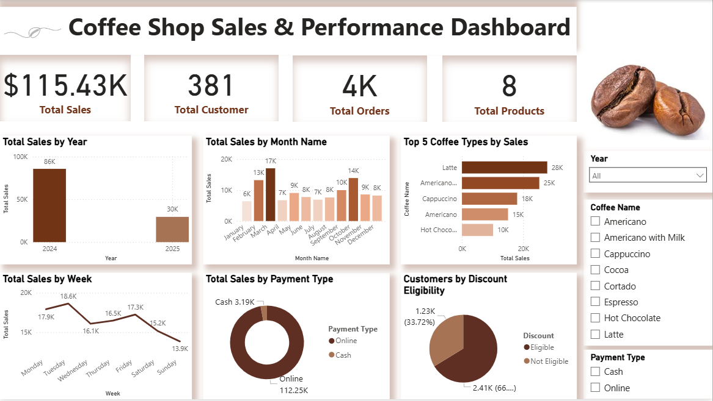

# ☕ Power BI Coffee Shop Sales & Performance Dashboard

An interactive **Power BI dashboard** analyzing sales performance, customer behavior, and product trends for a coffee shop.  

---

## 📊 Features
- **Total Sales, Customers, Orders & Products** overview  
- **Yearly, Monthly, and Weekly Sales** analysis  
- **Top Coffee Types by Sales**  
- **Payment Method Distribution** (Online vs Cash)  
- **Customer Discount Eligibility** analysis  
- Interactive filters: **Year, Coffee Type, Payment Type**  

---

## 🔗 Dataset
This dashboard is based on the public **Coffee Sales dataset** available on Kaggle.  
[View Dataset on Kaggle](https://www.kaggle.com/datasets/ihelon/coffee-sales)

*Note: Dataset is not included in this repository to respect licensing.*

---

## 🛠 Tools Used
- **Power BI** – Data Visualization & Dashboarding  
- **Excel** – Data cleaning & preprocessing  

---

## 🚀 How to View
1. Download the `.pbix` file.  
2. Open it in **Power BI Desktop**.  
3. Explore filters and visuals for insights.  

---

## 📌 Key Insights
- **Latte** is the top-selling coffee type (28K sales).  
- **April** has the highest sales (17K).  
- **Online payments** dominate over cash transactions.  
- A significant portion of customers are **eligible for discounts**.  

---

## 👩‍💻 About Me
*Data Analyst & Frontend Developer skilled in Power BI, Tableau, SQL, Python, Machine Learning, Digital Marketing & Web Development.*  
[LinkedIn](https://www.linkedin.com/in/vedika-sankhe-707700317/)  
